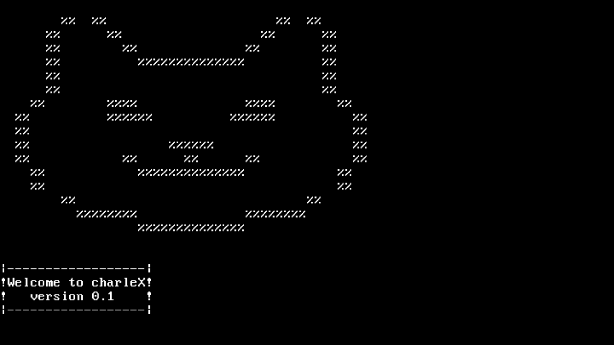

 


# charleX OS

## Logo

```
                  %%  %%                      %%  %%
                 %%      %%                  %%      %%
                 %%        %%              %%        %%
                 %%          %%%%%%%%%%%%%%          %%
                 %%                                  %%
                 %%                                  %%
               %%        %%%%              %%%%        %%
             %%          %%%%%%          %%%%%%          %%
             %%                                          %%
             %%                  %%%%%%                  %%
             %%            %%      %%      %%            %%
               %%            %%%%%%%%%%%%%%            %%
                %%                                    %%
                   %%                              %%
                     %%%%%%%%              %%%%%%%%
                             %%%%%%%%%%%%%%
```

## Description

CharleX OS is a minimal, open-source operating system kernel written primarily in C with assembly components. It provides a basic terminal interface in VGA text mode, supporting keyboard input for a simple command-line experience. This project serves as an educational platform for understanding low-level OS development.

The kernel includes features like:
- VGA text mode initialization and output
- Keyboard input handling with support for basic keys (enter, backspace, arrows, etc.)
- A simple shell-like prompt for user interaction
- Bootloader integration with GRUB

## Screenshots




## Building and Running

### Prerequisites
- GCC compiler
- NASM assembler
- GRUB tools
- xorriso for ISO creation

### On Debian/Ubuntu
Install dependencies:
```bash
make deps
```

Build the ISO:
```bash
make mkiso
```

Run the OS using a virtual machine or boot from the generated `charleX.iso`.

### On Windows 10

Building CharleX OS on Windows 10 requires using Windows Subsystem for Linux (WSL) to run Linux tools, since the build process uses GCC, NASM, and GRUB which are Linux-based. We'll use a PowerShell script (`build.ps1`) to automate the steps.

#### Prerequisites
- **PowerShell**: This is built into Windows 10. Open it by searching for "PowerShell" in the Start menu.
- **Windows Subsystem for Linux (WSL)**: This lets you run Linux commands on Windows.
  1. Open PowerShell as Administrator (right-click PowerShell and select "Run as administrator").
  2. Run this command: `wsl --install -d Ubuntu-24.04`
  3. Restart your computer if prompted.
  4. After restart, open the Ubuntu app from the Start menu. It will set up automatically (this might take a few minutes).
  5. Create a username and password when asked. Remember them!
- **Git**: Download and install from https://git-scm.com/downloads if you haven't already. This is needed to clone the repository.

#### Step-by-Step Build Instructions
1. **Clone or Download the Repository**:
   - Open PowerShell.
   - Navigate to where you want to put the project (e.g., `cd C:\Users\YourName\Desktop`).
   - Run: `git clone https://github.com/your-repo/charlex-os-ng.git` (replace with the actual repo URL).
   - Or download the ZIP from GitHub and extract it.

2. **Navigate to the Project Folder**:
   - In PowerShell, go to the project folder: `cd path\to\charlex-os-ng` (replace with your actual path).

3. **Install Dependencies**:
   - Run: `.\build.ps1 -Target deps`
   - This will update packages and install build tools in WSL. It might ask for your Ubuntu password (the one you set during WSL setup). If it fails, make sure WSL is installed and try again.

4. **Build the ISO**:
   - Run: `.\build.ps1 -Target mkiso`
   - This compiles the code and creates `charleX.iso`. It should complete without errors if dependencies are installed.

5. **Clean Up (Optional)**:
   - To remove build files (.bin and .o), run: `.\build.ps1 -Target clean`

#### Running the OS
- Use a virtual machine like VirtualBox or VMware to boot from `charleX.iso`.
- If you encounter issues, check that WSL is running (open Ubuntu app) and that all prerequisites are installed.

For WSL configuration, refer to `WSL_WINDOWS.CONF`.

## Contributing

CharleX OS is an open-source project, and contributions are welcome! Feel free to:
- Report issues
- Submit pull requests for bug fixes or new features
- Improve documentation
- Star the repository to show support

## License

This project is licensed under the MIT terms 